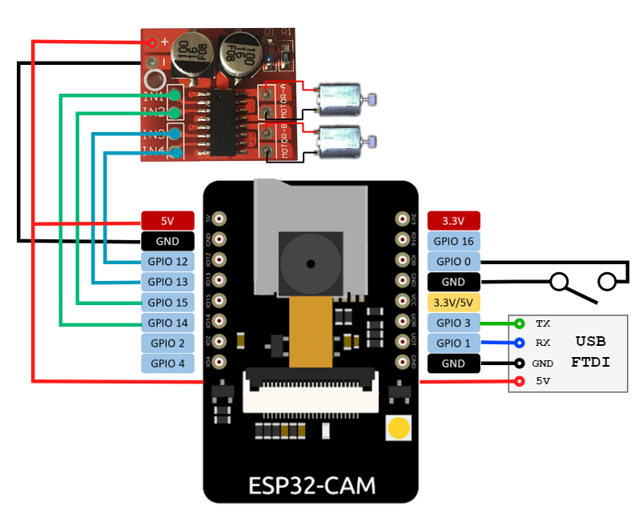

# ESP32 Car

ESP32-CAM + L298N driver for ROS.



## Installation

Flash the firmware onto the ESP32-Cam module first and wire according to the above diagram (switch has to be closed for flashing). Once the ESP boots it'll flash the built in LED once.

```
pip install websocket-client

sudo apt-get install ros-noetic-video-stream-opencv
```

## Usage

```

// start either ackerman or diff drive control
roslaunch esp32_ros ackermann.launch
roslaunch esp32_ros diffdrive.launch

// start camera streaming
roslaunch esp32_ros camera.launch

// start cam person detector + follower
roslaunch esp32_ros automove.launch
```
